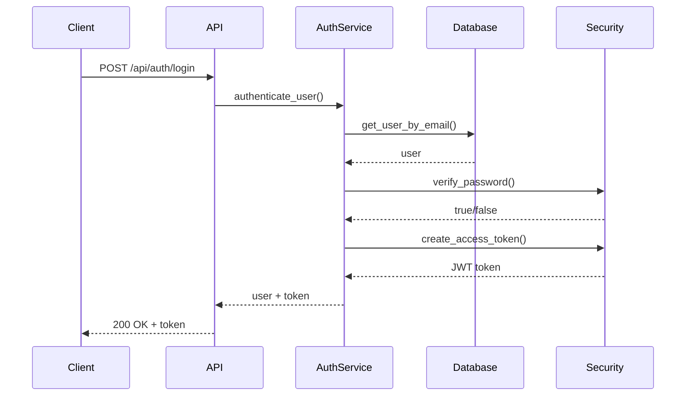
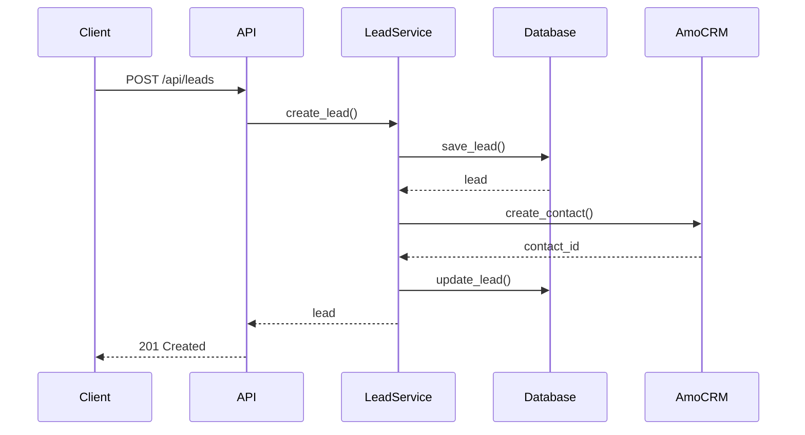

# Архитектура APEX Asia Property Exchange

## 🏗️ Обзор системы

APEX - это современная CRM система для управления недвижимостью в Азии, построенная на микросервисной архитектуре с использованием FastAPI, Next.js и PostgreSQL.

## 📁 Структура проекта

```
APEX-Asia-Property-EXchange-/
├── backend/                    # Backend API (FastAPI)
│   ├── app/
│   │   ├── core/              # 🎯 ЯДРО СИСТЕМЫ
│   │   │   ├── config.py      # Конфигурация приложения
│   │   │   ├── db.py          # Подключение к БД
│   │   │   ├── exceptions.py  # Кастомные исключения
│   │   │   ├── dependencies.py # FastAPI зависимости
│   │   │   ├── utils.py       # Утилиты
│   │   │   ├── logging.py     # Логирование
│   │   │   ├── security.py    # Безопасность
│   │   │   ├── middleware.py  # Middleware
│   │   │   └── retry.py       # Retry логика
│   │   ├── api/               # API endpoints
│   │   │   ├── auth_v2.py     # Аутентификация (новая версия)
│   │   │   ├── leads_v2.py    # Управление лидами (новая версия)
│   │   │   ├── analytics.py   # Аналитика
│   │   │   ├── notifications.py # Уведомления
│   │   │   └── webhooks.py    # Webhook обработчики
│   │   ├── services/          # Бизнес-логика
│   │   │   ├── auth_service.py
│   │   │   ├── lead_service.py
│   │   │   ├── analytics_service.py
│   │   │   └── notification_service.py
│   │   ├── schemas/           # Pydantic модели
│   │   │   ├── auth.py
│   │   │   ├── leads.py
│   │   │   ├── analytics.py
│   │   │   └── notifications.py
│   │   ├── models/            # SQLAlchemy модели
│   │   │   ├── user.py
│   │   │   ├── lead.py
│   │   │   └── deal.py
│   │   ├── integrations/      # Внешние интеграции
│   │   │   ├── amo/           # AmoCRM
│   │   │   ├── email/         # Email
│   │   │   ├── telegram/      # Telegram
│   │   │   └── whatsapp/      # WhatsApp
│   │   └── main.py            # Точка входа
│   ├── tests/                 # Тесты
│   │   ├── unit/              # Unit тесты
│   │   ├── integration/       # Integration тесты
│   │   ├── performance/       # Performance тесты
│   │   └── test_security.py   # Тесты безопасности
│   ├── alembic/               # Миграции БД
│   ├── requirements.txt       # Зависимости
│   ├── pyproject.toml         # Конфигурация проекта
│   ├── pytest.ini            # Конфигурация тестов
│   ├── .coveragerc           # Конфигурация coverage
│   └── Dockerfile            # Docker образ
├── frontend/                  # Frontend (Next.js)
│   ├── src/
│   │   ├── components/        # React компоненты
│   │   │   ├── ui/           # Базовые UI компоненты
│   │   │   └── auth/         # Компоненты аутентификации
│   │   ├── hooks/            # React хуки
│   │   │   ├── useAuth.ts    # Хук аутентификации
│   │   │   └── useForm.ts    # Хук управления формами
│   │   ├── lib/              # Утилиты
│   │   │   ├── api.ts        # API клиент
│   │   │   └── validation.ts # Валидация форм
│   │   ├── types/            # TypeScript типы
│   │   │   └── index.ts      # Основные типы
│   │   └── pages/            # Страницы Next.js
│   ├── tests/                # Тесты
│   │   └── e2e/              # E2E тесты
│   ├── package.json          # Зависимости
│   ├── tsconfig.json         # Конфигурация TypeScript
│   ├── .eslintrc.json        # ESLint конфигурация
│   ├── .prettierrc           # Prettier конфигурация
│   └── Dockerfile            # Docker образ
├── docs/                     # Документация
│   ├── ARCHITECTURE.md       # Архитектура
│   ├── SECURITY.md           # Безопасность
│   ├── API.md                # API документация
│   └── DEPLOYMENT.md         # Развертывание
├── docker-compose.yml        # Docker Compose
├── Makefile                  # Команды разработки
└── README.md                 # Основная документация
```

## 🎯 Core модуль - Детальное описание

### **core/** - Центральный модуль системы

#### 1. **config.py** - Конфигурация приложения
```python
# Основные настройки
environment: str = "development"
debug: bool = False
log_level: str = "INFO"

# amoCRM настройки
amocrm_client_id: Optional[str] = None
amocrm_client_secret: Optional[str] = None

# База данных
db_url: str = "postgresql://asia:asia@db:5432/asia_crm_staging"

# Безопасность
secret_key: str = "your-staging-secret-key"
jwt_secret: str = "your-staging-jwt-secret"
jwt_algorithm: str = "HS256"
jwt_expire_minutes: int = 30

# CORS
allowed_hosts: List[str] = ["localhost", "127.0.0.1"]
cors_origins: List[str] = ["http://localhost:3000"]
```

**Назначение:**
- Централизованное управление настройками
- Загрузка из переменных окружения
- Валидация конфигурации через Pydantic
- Поддержка разных окружений (dev/staging/prod)

#### 2. **db.py** - Подключение к базе данных
```python
# Создание движка базы данных
engine = create_engine(settings.db_url)

# Создание сессии
SessionLocal = sessionmaker(autocommit=False, autoflush=False, bind=engine)

# Базовый класс для моделей
Base = declarative_base()

# Dependency для получения сессии БД
def get_db():
    db = SessionLocal()
    try:
        yield db
    finally:
        db.close()
```

**Назначение:**
- Настройка подключения к PostgreSQL
- Создание SQLAlchemy сессий
- Dependency injection для FastAPI
- Автоматическое закрытие соединений

#### 3. **exceptions.py** - Кастомные исключения
```python
class APEXException(Exception):
    """Базовый класс для всех исключений APEX"""
    
class AuthenticationError(APEXException):
    """Ошибка аутентификации"""
    
class ValidationError(APEXException):
    """Ошибка валидации данных"""
    
class DatabaseError(APEXException):
    """Ошибка базы данных"""
    
class ExternalServiceError(APEXException):
    """Ошибка внешнего сервиса"""
```

**Назначение:**
- Единообразная обработка ошибок
- HTTP статус коды для API
- Детальная информация об ошибках
- Логирование исключений

#### 4. **dependencies.py** - FastAPI зависимости
```python
def get_current_user(
    credentials: HTTPAuthorizationCredentials = Depends(security),
    auth_service: AuthService = Depends(get_auth_service)
) -> User:
    """Получение текущего пользователя по JWT токену"""

def get_current_active_user(current_user: User = Depends(get_current_user)) -> User:
    """Получение текущего активного пользователя"""

def get_pagination_params(page: int = 1, per_page: int = 20) -> dict:
    """Параметры пагинации"""
```

**Назначение:**
- Dependency injection для FastAPI
- Аутентификация и авторизация
- Пагинация и поиск
- Валидация параметров

#### 5. **utils.py** - Утилиты
```python
def validate_phone(phone: str) -> bool:
    """Валидация номера телефона"""

def validate_email(email: str) -> bool:
    """Валидация email адреса"""

def calculate_cpl(total_cost: float, leads_count: int) -> float:
    """Расчет CPL (Cost Per Lead)"""

def generate_secure_token(length: int = 32) -> str:
    """Генерация безопасного токена"""
```

**Назначение:**
- Валидация данных
- Бизнес-расчеты
- Генерация токенов
- Форматирование данных

#### 6. **security.py** - Безопасность
```python
class SecurityUtils:
    @staticmethod
    def verify_password(plain_password: str, hashed_password: str) -> bool:
        """Проверка пароля"""
    
    @staticmethod
    def create_access_token(data: dict) -> str:
        """Создание JWT токена"""
    
    @staticmethod
    def verify_webhook_signature(payload: str, signature: str, secret: str) -> bool:
        """Проверка подписи webhook"""

class RateLimiter:
    """Rate limiter для API запросов"""
```

**Назначение:**
- JWT токены и аутентификация
- Хеширование паролей
- Проверка webhook подписей
- Rate limiting

#### 7. **middleware.py** - Middleware
```python
class SecurityMiddleware(BaseHTTPMiddleware):
    """Middleware для безопасности"""

class LoggingMiddleware(BaseHTTPMiddleware):
    """Middleware для логирования запросов"""

class IdempotencyMiddleware(BaseHTTPMiddleware):
    """Middleware для идемпотентности запросов"""

class WebhookSignatureMiddleware(BaseHTTPMiddleware):
    """Middleware для проверки подписи webhook"""
```

**Назначение:**
- Security headers
- Логирование запросов
- Идемпотентность
- Проверка webhook подписей

#### 8. **retry.py** - Retry логика
```python
class RetryConfig:
    """Конфигурация для retry логики"""

class RetryHandler:
    """Обработчик retry логики"""

class CircuitBreaker:
    """Circuit Breaker паттерн"""

@retry(max_attempts=3, base_delay=1.0)
async def external_api_call():
    """API call с retry"""
```

**Назначение:**
- Exponential backoff
- Circuit breaker паттерн
- Retry для внешних API
- Обработка временных сбоев

#### 9. **logging.py** - Логирование
```python
def setup_logging():
    """Настройка логирования"""

def get_logger(name: str) -> logging.Logger:
    """Получение логгера"""
```

**Назначение:**
- Структурированное логирование
- Разные уровни логирования
- Форматирование логов
- Ротация логов

## 🔄 Потоки данных

### 1. **Аутентификация пользователя**


### 2. **Создание лида**


## 🛡️ Безопасность

### **Многоуровневая защита:**
1. **JWT токены** - аутентификация
2. **Rate limiting** - защита от DDoS
3. **Webhook подписи** - проверка интеграций
4. **CORS** - защита от XSS
5. **Security headers** - защита от атак
6. **Валидация данных** - защита от инъекций

## 📊 Мониторинг

### **Метрики:**
- Response time
- Error rate
- Throughput
- Memory usage
- CPU usage

### **Логирование:**
- Request/response logs
- Error logs
- Security events
- Performance metrics

## 🚀 Развертывание

### **Docker Compose:**
```yaml
services:
  backend:
    build: ./backend
    ports:
      - "8000:8000"
    environment:
      - ENVIRONMENT=staging
    depends_on:
      - db
      - redis

  frontend:
    build: ./frontend
    ports:
      - "3000:3000"
    environment:
      - NEXT_PUBLIC_API_URL=http://localhost:8000

  db:
    image: postgres:15
    environment:
      - POSTGRES_DB=asia_crm_staging
      - POSTGRES_USER=asia
      - POSTGRES_PASSWORD=asia

  redis:
    image: redis:7-alpine
```

## 🔧 Разработка

### **Команды:**
```bash
# Установка зависимостей
make install

# Запуск в режиме разработки
make dev

# Запуск тестов
make test

# Проверка качества кода
make lint

# Форматирование кода
make format

# Запуск с Docker
make docker-up
```

## 📈 Масштабирование

### **Горизонтальное масштабирование:**
- Load balancer для API
- Репликация базы данных
- Redis cluster
- CDN для статических файлов

### **Вертикальное масштабирование:**
- Увеличение ресурсов серверов
- Оптимизация запросов к БД
- Кэширование
- Асинхронная обработка

## 🔮 Будущее развитие

### **Планируемые улучшения:**
1. **Микросервисы** - разделение на отдельные сервисы
2. **Event-driven архитектура** - асинхронная обработка событий
3. **GraphQL** - гибкий API
4. **Real-time уведомления** - WebSocket
5. **AI/ML интеграция** - предсказание лидов
6. **Мобильное приложение** - React Native
