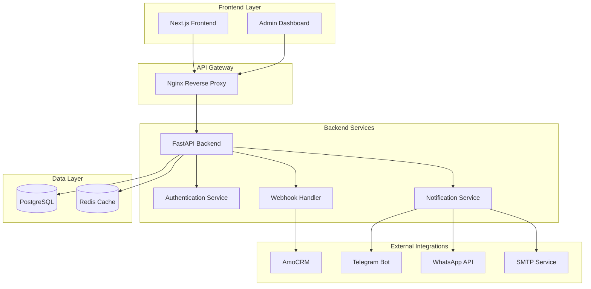
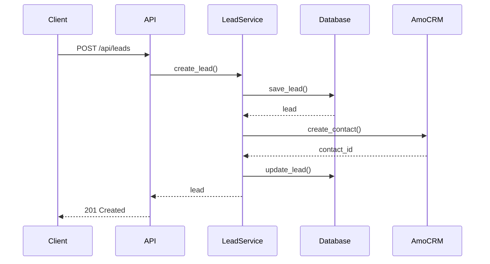

# 🏗️ Архитектура APEX

## 🎯 Обзор

Эта директория содержит документацию по архитектуре системы APEX Asia Property Exchange.

## 📁 Структура

```
docs/architecture/
├── README.md                    # Этот файл - обзор архитектуры
├── ARCHITECTURE.md              # Детальная архитектура системы
├── DESIGN_LOG.md                # Лог проектирования
└── REFACTOR_PLAN.md             # План рефакторинга
```

## 📋 Документация по архитектуре

### **ARCHITECTURE.md** - Детальная архитектура
**Назначение:** Полное описание архитектуры системы APEX

**Содержит:**
- ✅ Обзор системы
- ✅ Технологический стек
- ✅ Архитектурные диаграммы
- ✅ Структура проекта
- ✅ Потоки данных

**Для кого:** Архитекторы, разработчики, DevOps инженеры

### **DESIGN_LOG.md** - Лог проектирования
**Назначение:** История принятия архитектурных решений

**Содержит:**
- ✅ Принятые решения
- ✅ Альтернативы и trade-offs
- ✅ Статус проекта
- ✅ TODO backlog

**Для кого:** Архитекторы, технические лиды

### **REFACTOR_PLAN.md** - План рефакторинга
**Назначение:** План улучшения архитектуры

**Содержит:**
- ✅ Текущие проблемы
- ✅ Цели рефакторинга
- ✅ План изменений
- ✅ Риски и митигация

**Для кого:** Архитекторы, разработчики

## 🏗️ Архитектурные принципы

### **1. Микросервисная архитектура**
- Разделение ответственности
- Независимое развертывание
- Масштабируемость
- Отказоустойчивость

### **2. Event-driven архитектура**
- Асинхронная обработка
- Слабая связанность
- Масштабируемость
- Отказоустойчивость

### **3. API-first подход**
- RESTful API
- OpenAPI документация
- Версионирование API
- Backward compatibility

### **4. Security by design**
- Многоуровневая безопасность
- Defense in depth
- Zero trust
- Security monitoring

## 🔧 Технологический стек

### **Backend**
- **Framework:** FastAPI (Python 3.11+)
- **ORM:** SQLAlchemy 2.0
- **Миграции:** Alembic
- **База данных:** PostgreSQL
- **Кэширование:** Redis
- **Аутентификация:** JWT + OAuth2
- **Валидация:** Pydantic v2

### **Frontend**
- **Framework:** Next.js 14 (App Router)
- **Язык:** TypeScript (строгий режим)
- **Стилизация:** Tailwind CSS
- **Состояние:** React Query + Zustand
- **Формы:** React Hook Form + Zod

### **Infrastructure**
- **Контейнеризация:** Docker + Docker Compose
- **Оркестрация:** Kubernetes (production)
- **CI/CD:** GitHub Actions
- **Мониторинг:** Prometheus + Grafana
- **Логирование:** Structured JSON logs

## 📊 Архитектурные диаграммы

### **Системная архитектура**


### **Поток данных**


## 🎯 Ключевые компоненты

### **1. API Gateway (Nginx)**
- Обратный прокси
- SSL/TLS терминация
- Rate limiting
- CORS настройки

### **2. Backend API (FastAPI)**
- REST API endpoints
- WebSocket соединения
- Аутентификация и авторизация
- Валидация данных

### **3. Authentication Service**
- JWT токены
- OAuth2 интеграция
- Управление сессиями
- RBAC (Role-Based Access Control)

### **4. Webhook Handler**
- Валидация подписей
- Обработка событий
- Idempotency
- Retry логика

### **5. Notification Service**
- Email уведомления
- Telegram сообщения
- WhatsApp сообщения
- Push уведомления

## 🔒 Безопасность

### **Многоуровневая защита**
1. **JWT токены** - аутентификация
2. **Rate limiting** - защита от DDoS
3. **Webhook подписи** - проверка интеграций
4. **CORS** - защита от XSS
5. **Security headers** - защита от атак
6. **Валидация данных** - защита от инъекций

### **Security by design**
- Zero trust архитектура
- Defense in depth
- Principle of least privilege
- Security monitoring

## 📈 Масштабируемость

### **Горизонтальное масштабирование**
- Stateless API сервисы
- Балансировка нагрузки
- Кэширование в Redis
- Read replicas для PostgreSQL

### **Вертикальное масштабирование**
- Оптимизация запросов к БД
- Индексы для горячих запросов
- Connection pooling
- Мониторинг производительности

## 🔄 Мониторинг и логирование

### **Метрики**
- Prometheus для сбора метрик
- Grafana для визуализации
- Health checks для всех сервисов
- Business metrics

### **Логирование**
- Structured JSON logs
- Централизованное логирование
- Log levels (DEBUG, INFO, WARNING, ERROR)
- Correlation IDs

### **Трейсинг**
- Distributed tracing
- Performance monitoring
- Error tracking
- User experience metrics

## 🚀 Развертывание

### **Development**
- Docker Compose для локальной разработки
- Hot reload для frontend и backend
- Локальная база данных
- Mock внешних сервисов

### **Staging**
- Kubernetes кластер
- Автоматическое развертывание
- Тестовые данные
- Интеграционные тесты

### **Production**
- Kubernetes кластер
- Blue-green деплойменты
- Автоматическое масштабирование
- Backup и disaster recovery

## 🔮 Будущее развитие

### **Краткосрочные цели**
- Улучшение покрытия тестами
- Оптимизация производительности
- Расширение API документации
- Улучшение UX

### **Долгосрочные цели**
- Микросервисная архитектура
- Event-driven архитектура
- Machine Learning интеграция
- Мобильное приложение

## 🔗 Связанная документация

- [CI/CD документация](../cicd/README.md) - автоматизация
- [Настройка](../setup/README.md) - настройка компонентов
- [Интеграции](../integrations/README.md) - внешние интеграции
- [Быстрый старт](../quickstart/README.md) - быстрый старт

## 📞 Поддержка

При возникновении вопросов:

1. Обратитесь к `ARCHITECTURE.md` для детального описания
2. Проверьте `DESIGN_LOG.md` для истории решений
3. Изучите `REFACTOR_PLAN.md` для планов развития
4. Создайте issue в репозитории

---

**Архитектура системы APEX спроектирована! 🎉**
